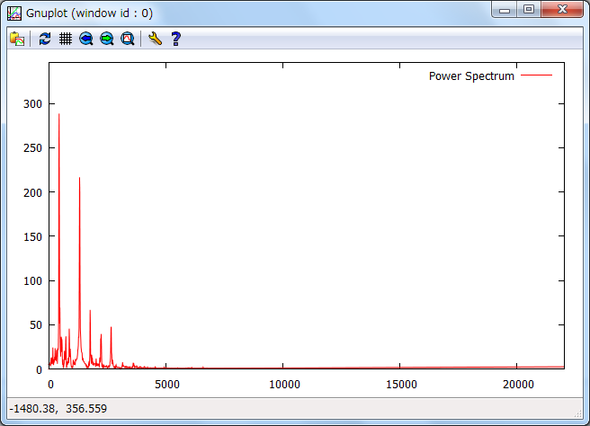

音声ファイルのフーリエ変換を行うプログラム
=====

音声ファイルのフーリエ変換を行い、gnuplotで周波数毎のパワースペクトルを表示します。  
## コンパイル
#### [Windows-MinGW, Cygwin, Linux]
$ make  
$ make -f clang.mk  
gccで、LTOやOpenMPを利用する場合は、以下のように指定してください  
$ make LTO=true OMP=true  

#### [Microsoft Visual C++]
\> nmake /f MSVC.mk  

## 使い方
$ ./waveAnalyzer [解析対象wavファイル] [フーリエ変換のサイズ]  
例：$ ./waveAnalyzer sound/piano_440hz.wav 4096

  

## プログラムの実行に必要なこと
gnuplotにパスが通っていること